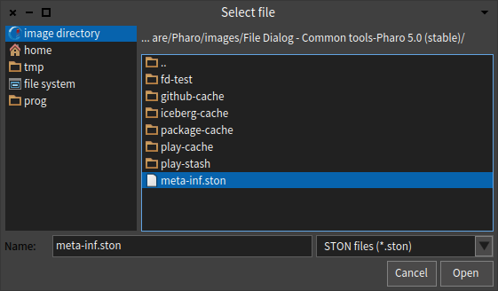
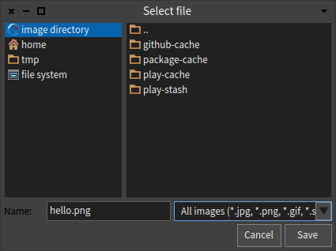
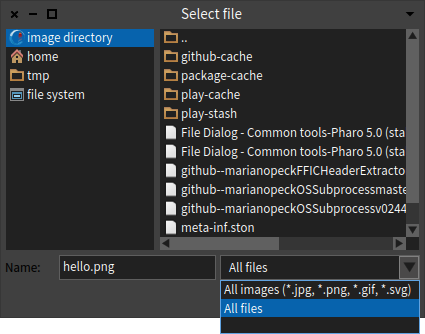

# File Dialog
[](https://travis-ci.org/pharo-contributions/file-dialog) [](https://coveralls.io/github/pharo-contributions/file-dialog)

A simple replacement for Pharo's native file/folder selection dialog.



## Features

* list of most common places (home, root, image directory, temp)
* custom bookmarks by dragging folders from file-pane to bookmark-pane
* toggle hidden files (right-click on file listing)
* preset file name
* filtering files by extensions or patterns and toggling between filters
* synchronous and asynchronous mode

## Installation

(catalog soon)

```st
Metacello new
	baseline: 'FileDialog';
	repository: 'github://pharo-contributions/file-dialog/repository';
	load.
```

### Replacing native dialogs

If you feel brave, you can replace the native dialogs everywhere in the system by running

```st
FDMorphicUIManager new beDefault
```

Of course you can switch back anytime you want.

```st
MorphicUIManager new beDefault
```

## Howto

If you chose using the extended UIManager, then you can use that

```st
UIManager default chooseFileMatching: #('*.ston')
```

You can also use the classes directly — there are just minor differences in the behavior, such as `DirectoryDialog` will not show files, etc.

### Classes

* `FDSaveFileDialog` - saving a file
* `FDOpenFileDialog` - selecting a file
* `FDOpenDirectoryDialog` - selecting a directory

### API

The user-facing API is in the `public` protocol of `FDFileDialog`

* `defaultFolder: aPath` — where should the dialog open, the default is the imageDirectory
* `defaultName: aString` — prefill the file name input
* `extensionFilters: aCollection` — a collection of `label -> extensions` filters
* `fileFilters: aCollection` — a collection of `label -> pattern` filters
* `whenSelected: aBlock` — a one arg block executed when a file was selected
* `openModal` — when you open the dialog as modal, you will get the selected value as a return instead of using the block

`extensionFilters:` is just a convenience for `fileFilters:` automatically adding labels & stuff, so the following is equivalent

```
extensionFilters: { 'STON files' -> #(ston json) }
fileFilters: { 'STON files (*.ston, *.json)' -> #('*.ston' '*.json') }
```

## Custom Icons


## Example

asynchronous — execute behavior on selection from a block

```st
FDOpenFileDialog new
	whenSelected: [ :file | file inspect ];
	extensionFilters: {
		'All images' -> #(jpg png gif svg).
		'All files' -> #()
	};
	defaultFolder: FileLocator imageDirectory asFileReference;
	open
```

synchronous — return the selected file as a value

```st
file := FDOpenFileDialog new
	openModal
```




